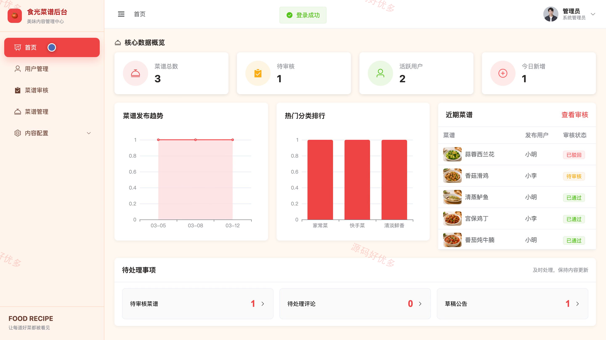
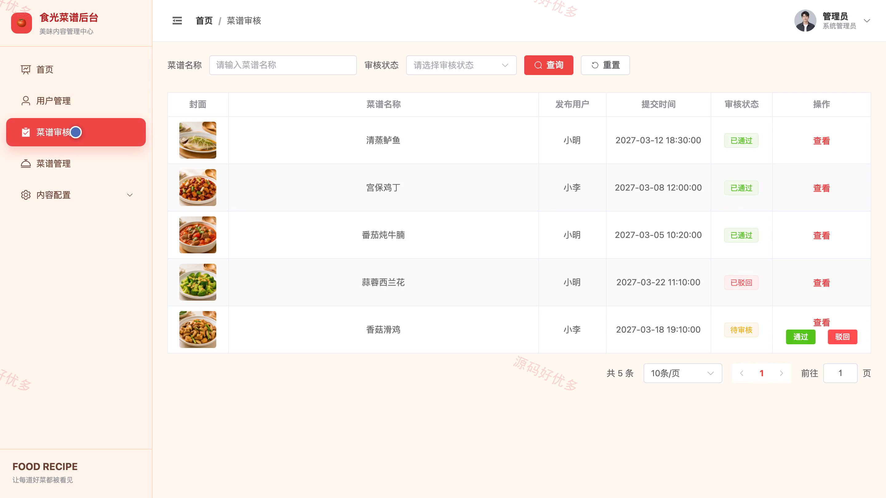
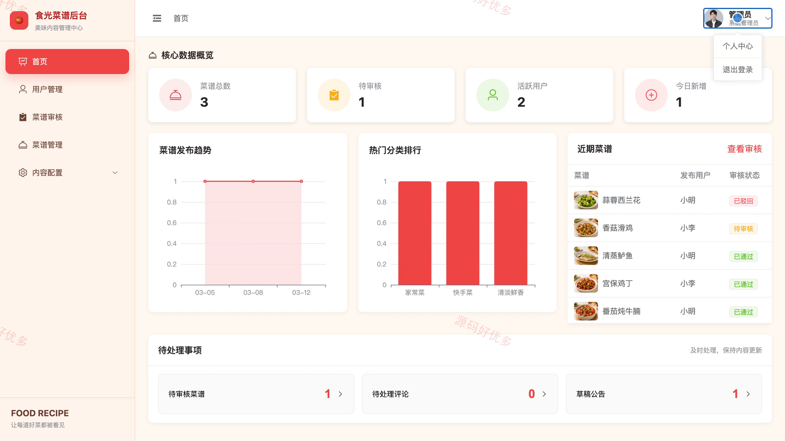

# bs069A
bs069A美食菜谱推荐系统
## 源码问题查看主页咨询

### 一、关键词
美食菜谱推荐、菜谱大全、家常菜做法、美食分享社区、健康饮食搭配

### 二、作品包含
源码+数据库+万字设计文档+PPT+全套环境和工具资源+本地部署教程

### 三、项目技术
前端技术： Html、Css、Js、Vue3.4、Element-Plus
后端技术：Java、SpringBoot3.2.0、MyBatis-Plus

### 四、运行环境（以下版本亲测，其他版本兼容性请自行测试）
开发工具：IDEA/eclipse + VSCODE

数据库：MySQL5.7+（共11张表）

数据库管理工具：Navicat10以上版本

环境配置软件： JDK17 + Maven

前端Nodejs：20.20.2

浏览器：谷歌浏览器

### 五、项目介绍
项目编号：bs069A

美食菜谱推荐系统面向管理员、用户，提供项目核心业务等功能，实现各角色在系统中的实际业务协作。

角色：用户、管理员

用户功能：注册登录、个性化推荐、菜谱搜索筛选、菜谱详情、食材找菜、菜谱收藏、评分评论、菜谱发布与管理。

管理员功能：用户管理、菜谱审核、菜谱管理、分类标签管理、食材资料管理、评论管理、公告管理、数据统计。

### 六、运行截图

